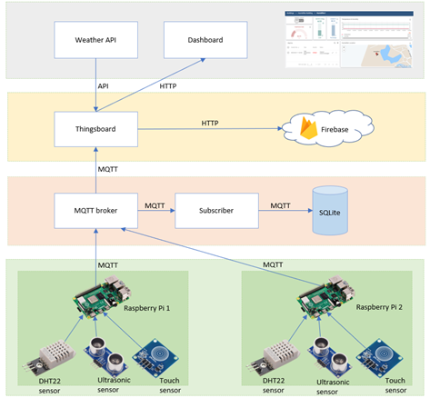
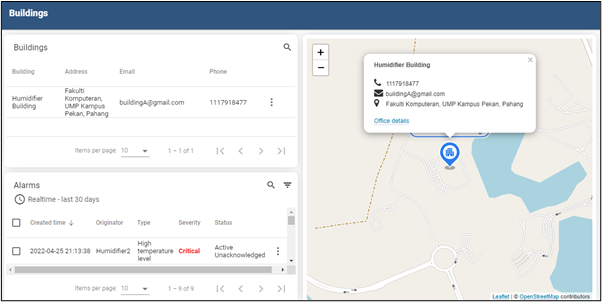
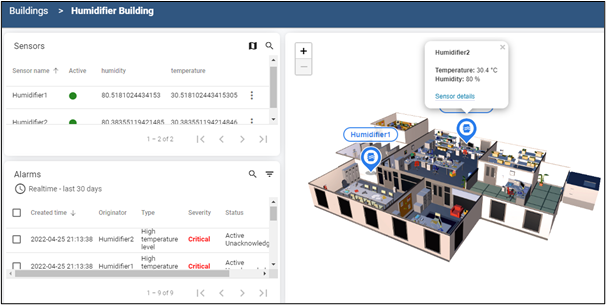
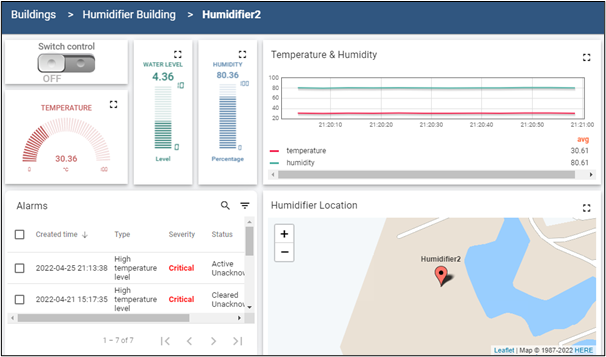
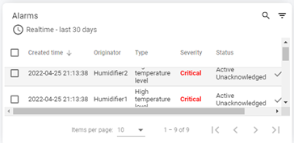

# Humidifieryu

Humidifieryu enables wireless control of humidifiers, featuring automatic functions and remote access. Built using Raspberry Pi, MQTT, SQLite, Firebase, and Thingsboard.

[Documentation Link](https://docs.google.com/document/d/1vsX6TnJmZdV1Dld4LS_BJR-UVwAA0PGREqZGUc8Pvko/edit?usp=sharing)

## GUI

- The architecture design illustrates the IoT setup.

- The main dashboard displays buildings equipped with our humidifiers.

- This dashboard presents detailed information for selected buildings, including the number of humidifiers and alarm alerts.

- Real-time updates feature current humidity, temperature, and humidifier water level, with alarm notifications.

- Alarm notifications alert users to high temperatures via a table interface.

- The exchange of messages in MQTT protocol using QoS1 is depicted.

Explore the detailed functionality of Humidifieryu in the provided documentation.
