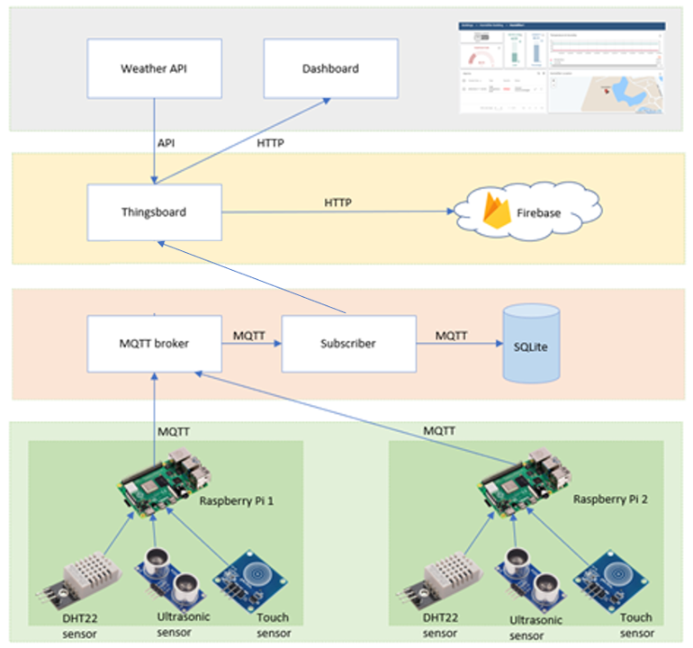

# Humidifieryu
Wirelessly control the humidifier (auto funtion features and remote) using Raspberry Pi, MQTT, SQLite, Firebase, Thingsboard

Documentation link : https://docs.google.com/document/d/1o80Cyym8PGqP5UMkiQmYfeYMJnGSAGMQC05QYpLXVwM/edit?usp=sharing

notes..

notes..

notes..

notes..

notes..

notes..

